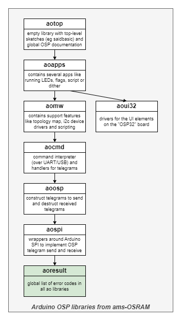

# OSP ResultCodes aoresult

Library "OSP ResultCodes aoresult", usually abbreviated to "aoresult",
is one of the **aolibs**; short for Arduino OSP libraries from ams-OSRAM.
This suite implements support for chips that use the Open System Protocol, 
like the AS1163 ("SAID") or the OSIRE E3731i ("RGBi").
The landing page for the _aolibs_ is on 
[GitHub](https://github.com/ams-OSRAM-Group/aotop).

## Introduction

Library _aoresult_ is at the base of the dependency graph.
It contains (defines) a list of all error codes that
may occur in any of the _aolibs_.
As a result, library _aoresult_ is relatively empty.

## Examples

This library comes with the following examples.
You can find them in the Arduino IDE via 
File > Examples > OSP ResultCodes aoresult > ...

-  **aoresult_demo**  
   This demo shows how to use the result codes from the aoresult lib.
   It also demonstrates the "assert" feature.

## API

The header [aoresult.h](src/aoresult.h) contains the API of this library.
The header contains little documentation; for that see the
[aoresult.cpp](src/aoresult.cpp) source file. 

Here is a quick overview:

- `aoresult_t` the global list of error codes in the _aolibs_ (enumeration data type).

- `aoresult_to_str()` converts an error code to a (short) string or a (longer) description.

- `AORESULT_ASSERT(cond)` Checks if `cond` holds, if not, prints error to `Serial`, and stops.

- Finally, there is the macro `AORESULT_VERSION`, which identifies the version of the library.

## Version history _aoresult_

- **2024 July 7, 0.2.0**  
  - Arduino name changed from `OSP Result codes - aoresult` to `OSP ResultCodes aoresult`.
  - Renamed dir `extra` to `extras`.

- **2024 July 3, 0.1.11**  
  - `license.txt`, `aoresult_demo.ino` line endings changed from LF to CR+LF.

- **2024 July 02, 0.1.10**  
  - Initial release candidate.

(end)
